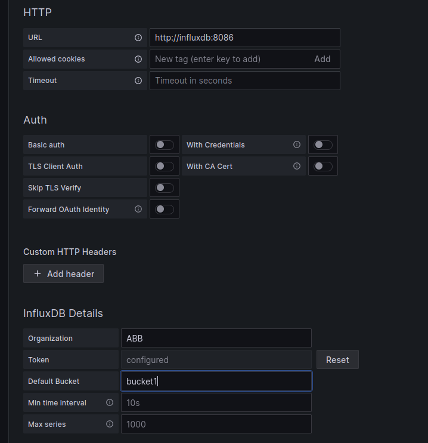
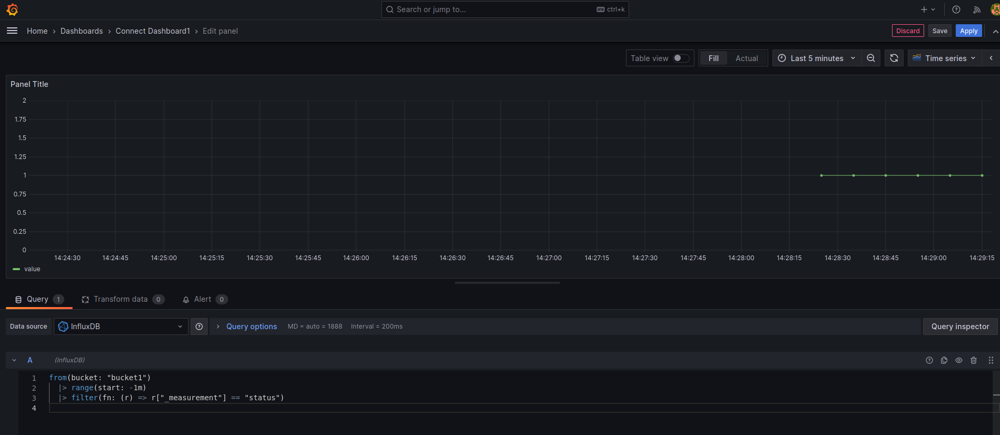

# Technical document

### Automated provisioning
I have worked everything from the same github repository.

At this point I simulate a repository on github validated by ssh key. As it is a new machine I have to prepare everything and for this reason there are extra steps.

The playbook is playbook-deploy-docker.yml which installs the docker package, connects to github, downloads the repository (theoretically there should only be scritps and docker-compose) and runs the point 2.

### scripting.
I'm used to making a script that runs only once. But after a while I understood that it should be running permanently, and here I already made a connect.sh script that checks the connection with the router and displays the message. Then I complicated it and going ahead to point 3 I added that it inserts the results into the influxdb database. While testing I saw that I needed to have control over the script to start and stop and I created service.sh to handle the script.

### Web app optimization  
The playbook playbook-deploy-grafana-influx.yml runs docker-compose and starts the influxdb and grafana service.

Here you need to configure the database in grafana.
http://localhost:3000 username and password admin. home --> connections --> influxdb --> add new source

The token is in the .env of the repository which is what is configured in docker-compose.

Let's go back to Home --> Dashboard --> new --> import Here it allows us to import a file that is also in the dashboard.json repository
I had to edit the dashboard and select the data source again, but once done it already draws the state of the script.

  
### Networking << >>  
                            1. Who you connect to the edge  
                                a. what ip range  
                                b. what protocol you should use to connect  
                                c. write the linux command or the connection string for this protocol   
                            2. Write 3 different things you should check  
                            3. Write 5 different error that should happened  

5 Documentation -Write a short recipe as a knowledge database solving one of the possible errors on the step 4.  

## Answers                           
4  
1 >   
a. Public ip 89.32.42.4  
b. Connect with SSH protocol  
c. ssh support@89.32.42.4  
  
2 >   
 2.1 -> Check connection between edge/server and new ip.   
 2.2 -> Maybe the vpn is down. Check connection with ping or traceroute between edge/server, another device in 192.168.2.0/23. Check status VPN.    
 2.3 -> The VPN is UP, but monitoring server can't connect with 10.2.3.0/32 
Check with ping or traceroute what's happen. Interface is UP?.  

3 >   
 3.1 -> VPN is down. Check connection.  
 3.2 -> edge/server can't access to new ip.  
 3.3 -> In 192.168.2.0/23 can't access to 10.2.3.0/32. The route not has created in edge/server.   
 3.4 -> Human error. The new entry is wrong.   
 3.5 -> Net interface is down  
   
5  
  
Error: The monitoring tool is not storing any data even though the IP and database hostname have been added.   
  
Steps to Resolve:   
  
  Verify SSH Connection to the Edge Machine:  
  ssh -v support@89.32.42.4  
  Check Network Configuration:  
  a. If connect, execute command << ip a >> display all interfaces. Ensure that the interface connected to the factory has the correct IP (10.2.3.0/32) and is active. Command <<sudo ip link set "interface-factory" up>>  
  b. Search interface network 192.168.2.0/23 with << ip a >>.   
  c. Ping to other device in network 192.168.2.0/23.   
  d. VPN is up? check logs. Restart service.   
